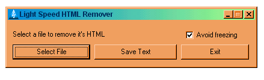



## Light Speed HTML Remover \- It removes HTML at an average of 1 MB/sec \!\!\!

### Description

Light Speed HTML Remover is a super fast HTML remover, when compiled it removes HTML of a file at a rate of 1 MB/second on a Pentium I 500 mhz

It's very easy to use, you only select a file, then HTML is removed, and then if you want to save the new file only click "Save Text" and you can save it to a text file.

Also the HTML remove function is in a reusable module so you can use it in your applications, code is clean and well commented.

Don't forget to vote!!! :) I will appreciate it.

Also all comments will be very appreciated.

Thanks.
 
### More Info
 

             |
---                |---
**Submitted On**   |2002-11-13 22:00:48
**By**             |[Design7 Software](https://github.com/Planet-Source-Code/PSCIndex/blob/master/ByAuthor/design7-software.md)
**Level**          |Intermediate
**User Rating**    |5.0 (45 globes from 9 users)
**Compatibility**  |VB 5\.0, VB 6\.0
**Category**       |[Complete Applications](https://github.com/Planet-Source-Code/PSCIndex/blob/master/ByCategory/complete-applications__1-27.md)
**World**          |[Visual Basic](https://github.com/Planet-Source-Code/PSCIndex/blob/master/ByWorld/visual-basic.md)
**Archive File**   |[Light\_Spee14969311132002\.zip](https://github.com/Planet-Source-Code/design7-software-light-speed-html-remover-it-removes-html-at-an-average-of-1-mb-sec__1-40698/archive/master.zip)

